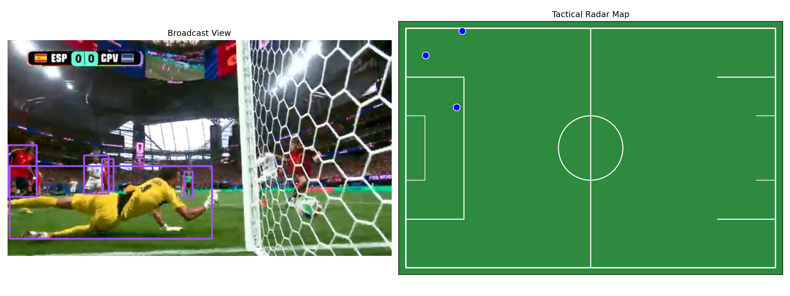

# Team Tactical Map

[](CHANGELOG.md)
[](LICENSE)
[](#)
[](https://colab.research.google.com/github/rwiren/team-tactical-map/blob/main/notebooks/broadcast_to_radar.ipynb)


Computer vision pipeline that converts video footage into a 2D tactical radar map — tracking team members, assigning teams by color, and projecting positions onto a top-down field view.

## Use Cases

| Source | Application | Status |
|--------|-------------|--------|
| ⚽ Football broadcast | Tactical analysis, player positioning | ✅ Active |
| 🏀 Basketball / 🏒 Ice hockey | Court/rink mapping | 🔴 Planned |
| 🚁 Drone overhead footage | Full-field nadir tracking | 🔴 Planned |
| 🎖️ Military / tactical | Team movement on terrain map | 🔴 Planned |

## Sample Output



## Pipeline

```
Input Video (broadcast / drone / tactical)
    │
    ├─► Object Detection (YOLOv8) ──► Tracking (ByteTrack)
    │                                      │
    │                                      ├─► Team Classification (K-means jersey color)
    │                                      │
    ├─► Field Keypoint Detection ──────────┴─► Homography Matrix (cv2.findHomography)
    │
    └─► 2D Tactical Radar Rendering (positions on field template)
```

## Quick Start

```bash
pip install ultralytics supervision opencv-python numpy matplotlib
```

```python
python src/tactical_map.py --video match_clip.mp4 --output radar_output.mp4
```

## Features

- **Player detection & tracking** — YOLOv8 + ByteTrack with persistent IDs
- **Team separation** — K-means clustering on jersey pixel colors
- **Pitch registration** — Automatic (keypoint model) or manual (4-point click)
- **2D radar output** — Real-time mini-map with team-colored dots
- **Multi-sport ready** — Field template is configurable (football, basketball, hockey, custom)
- **Drone-ready** — Placeholder for nadir footage (simpler homography, no perspective distortion)

## Project Structure

```
├── notebooks/
│   └── broadcast_to_radar.ipynb    ← Colab notebook (start here)
├── src/
│   ├── tactical_map.py             ← Main pipeline script
│   ├── team_classifier.py          ← Jersey color clustering
│   ├── pitch_registration.py       ← Homography estimation
│   └── radar_renderer.py           ← 2D field rendering
├── templates/
│   ├── football_pitch.png          ← Standard FIFA pitch (105×68m)
│   ├── basketball_court.png        ← NBA court
│   └── custom_terrain.png          ← Military/tactical (placeholder)
├── data/
│   └── sample_clips/               ← Test videos
└── outputs/
    └── radar/                      ← Generated outputs
```

## References

- [Roboflow Sports](https://github.com/roboflow/sports) — pitch keypoint detection models
- [supervision](https://github.com/roboflow/supervision) — CV toolkit (annotators, tracking)
- [SportsLabKit](https://github.com/AtomScott/SoccerTrack) — academic sports tracking
- [Ultralytics YOLOv8](https://docs.ultralytics.com/) — object detection
